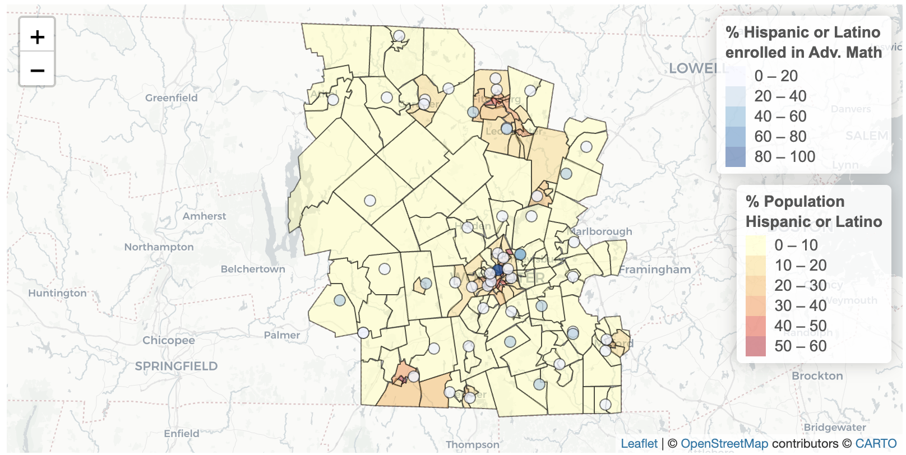

# Mini-Project 3

# Overview

Every two years, the US Department of Education Office for Civil Rights surveys pre-K-12 schools across the country about access to educational resources and school climate concerns, disaggregated by race, ethnicity, sex, disability, and English Learners. In this project, you will create one plot and one map that examines a civil rights issue in pre-K-12 schools in a particular U.S. county. You will then write up your findings in a short blog post (400-500 words). This project will require you to draw on a number of skills you have learned in this course, including data visualization, data wrangling, data joining, pivoting data, tidying data, writing functions, and mapping. 

# Learning Goals

- Tidy datasets to prepare them for analysis and visualization
- Interpret and write functions in `R`
- Produce maps of data in leaflet
- Effectively classify numeric data into color bins for mapping
- Communicate data findings in writing
- Evaluate the ethical dimensions of data resources

# Detailed Instructions

## Get to know the Data Sources

1. Read about the Civil Rights Data Collection program [here](https://civilrightsdata.ed.gov/about/crdc).

2. See a list of definitions that apply to this data  [here](https://civilrightsdata.ed.gov/assets/downloads/2021-2220List20Definitions.pdf).

3. Download the data documentation for this dataset [here](https://civilrightsdata.ed.gov/assets/downloads/2021-22%20Appendix%20Workbook.xlsx). The data dictionary is in Tab B. Note that there are several data files for this dataset. This data dictionary includes definitions for all files *including restricted files that we do not have access to.* You can check the Availability column to see if you have access to the data via the public use files. 


## Set up your environment

1. In RStudio, `File` > `New Project` > `Version Control` > `Git` and then copy the URL to this repo. Open `school_analysis.qmd` and add your group member's names to the header (lines 5, 7, and 9). 
2. Navigate to the [CRDC Files](https://civilrightsdata.ed.gov/assets/ocr/docs/2020-21-crdc-data.zip), and download the 2021-2022 files. Unzip the folder and then move it into your project directory. **Note that all members of your group will need to do this. The datasets are too large to push to GitHub.** I have already added the data directory name to the `.gitignore` file, so as long as you don't change the folder name, the files will not push. 
3. Select one of the data files in the `SCH` folder of `2020-21-crdc-data` with a metric you would like to investigate in your analysis. **You must select a metric that examines a school experience across race and gender.** For example, in the example file that I provided, I selected the `Advanced Mathematics.csv` file. There are variables in that file that examine Enrollment in Advanced Mathematics courses across race and gender. 
4. In `school_analysis.qmd`, load all relevant libraries and import the data that I have provided you with. In the code chunk starting at line 45, read the CSV file for the metric you selected into RStudio. Subset the data to only include the `COMBOKEY` column (the unique value for the school), and the columns that identify values across race and gender for exactly one metric of your choosing. I have provided sample code to import data that documents overall school enrollment across race and gender to get you started with this. You will need this data frame later to calculate percentages. 
5. In `school_analysis.qmd` in the code chunk starting at line 64, import the locations of K-12 schools, and convert the file to an `sf` object. The locations are originally encoded in CRS 4269, and you should transform it into a CRS that is compatible with leaflet. 
6. **If you have not already**, install the Tidy Census package in `R` using:

* `install.packages("devtools")`
* `install.packages("remotes")`
* `remotes::install_github("walkerke/tidycensus")`.

7. **If you have not already**, create an API Key for accessing census data [here](https://api.census.gov/data/create_success.html). The key will be emailed to you, and you must activate it with the link you receive in your email. **NOTE: It may take several minutes to activate. If you click on the link in your email, and it doesn't work, try again in a bit.** After activating your census key, enter the following into your console, replacing `KEY_HERE` with your census key. 

```
census_api_key("KEY_HERE", 
               overwrite = FALSE, 
               install = TRUE)
```

## Analysis

In this project, you need to write two functions: 

### `create_plot`

This function will take one input - a 5-digit county FIPS code (the first two digits represent the state and the second three represent the county).

The function should output one plot that visualizes the *percentage* of students in that county that meet your metric (e.g. are enrolled in advanced math classes, or have been subject to corporal punishment), by race and gender. The plot should have a descriptive title and label that identifies the unit of observation, variables, geography, time frame, and filters.

### `create_map`

This function will take two inputs. First, it will take a 5-digit county FIPS code. Second, it will take a string indicating a racial demographic that will be represented on the map. Racial demographics should be formatted as follows:

\_AM\_, \_AS\_, \_BL\_, \_HI\_, \_HP\_, \_TR\_, \_WH\_. The reasoning for this formatting will likely become more apparent to you as you work on the assignment. You can refer to the data dictionary for an explanation of these abbreviations. 

The function should output a map of the input county with two layers. The first layer should visualize the *percentage* of the population in each tract of your county that are of the race input into the function. The second layer should visualize the *percentage* of students of that race in that county that meet your metric. You consider how best to classify your data into colors, and your maps should have descriptive legends.

I have provided you the code to set the input variables and to run the functions. For this assignment, it is your job simply to write the functions. 

### Example

I went to high school in Worcester County, Massachusetts. My high school was Blackstone-Millville Regional High School - a school right on the border of Massachusetts and Rhode Island. I decided to examine how Enrollments in Advanced Mathematics courses differed across gender and race in Worcester County. My `create_plot` function produced this output. 


In noticing that the percent of Hispanic students enrolled in Advanced Mathematics courses was lower than that of other racial/ethnic demographics, I decided to create a map that visualized the percentage of Hispanic students enrolled in Advanced Mathematics courses at schools across the county. My `create_map` function produced this output. 



### Some Notes, Restrictions, and Tips

- **You may not input any additional variables into your functions.** I should be able to run `create_plot` with just a county FIPS code and `create_map` with just a county FIPS code and race abbreviation. 
- Note that to successfully complete this assignment, in addition to creating a plot and a map, you will need to perform joins, pivots, and various forms of data wrangling. To create descriptive variables, you will need to be able to manipulate strings, and to clean up your data for plotting, you will need to engage a number of data cleaning functions. You should be prepared to draw from your full toolbox of data science skills to complete this assignment. 
- You may use any of the helper functions that I provided to you in the Quarto document. For example, there are functions to acquire census data for a given county and race, and to return a full description for a given race abbreviation. You will likely need all of these functions to successfully complete this assignment. Take some time to interpret what each functions does before you get started. 
- While not required, you may choose to create your own helper functions. For example, in my solutions file I created separate functions for transforming the data, and I called these functions from inside `create_plot` and `create_map`. Helper functions can make your code more readable and easily maintainable.
- Tip: I highly recommend starting this assignment by getting your plot and map to render for one given county and one given race *outside* of the functions. Once you get the plot/map working, you can move your code inside the function and adjust it so that it works for any given county or race. 

## Write report

1. In 400-500 words, you should write up your findings:
  * Paragraph 1: Introduce the county and metric you selected
  * Paragraph 2: Report on findings from your analysis.
  * Paragraph 3: Summarize the key takeaway from your analysis and describe at least one ethical concern we should consider when analyzing this data. As a reminder of our ethics framework for this course:
    * What assumptions and commitments informed the design of these datasets?
    * Who has had a say in data collection and analysis regarding these datasets? Who has been excluded?
    * What are the benefits and harms of these datasets, and how are they distributed amongst diverse social groups?
2. When you are done, you should save the .qmd file, Render the file, commit changes, and then push changes back to GitHub. That's it for submission. You don't need to submit anything on Moodle. 

# Evaluation 

You will be evaluated on the extent to which your mini-project demonstrates fluency in the following course learning dimensions:

- Tidying and Pivoting Data (15 points)
  - Have you successfully reshaped a data frame longer?
  - Have you cleaned data to prepare it for plotting and analysis?
- Writing Functions and Iteration (15 points)
  - Have you successfully interpreted and leveraged helper functions?
  - Have you successfully created your own functions?
  - Have you demonstrated an ability to perform functions `across()` variables and observations that meet certain criteria?
- Working with Spatial Data (5 points)
  - Have you successfully converted CSV data into `sf` object?
  - Have you transformed data to an appropriate coordinate reference system?
- Point Mapping (15 points)
  - Have you produced a map that plots points by latitude and longitude?
  - Have you demonstrated effective color classification?
  - Does your map have a descriptive legend?
- Polygon Mapping (15 points)
  - Have you produced maps that plot polygons?
  - Have you demonstrated effective color classification?
  - Does your map have a descriptive legend?
- Data Ethics (10 points)
  - Does your blog post demonstrate thoughtful consideration of the ethics of this data collection?

Additionally the following will be factored into your grade:

- All components of the assignment were complete (10 points)
  - Did you complete the group contract, fill out the contributions statement, and meet the minimum word count?
  - Was the assignment submitted as an HTML document rendered from Quarto?
- Accuracy and Effectiveness of Conclusions (10 points)
  - Did your interpretations of the plot/map demonstrate a thorough understanding of the underlying data?
  - Were your interpretations of the plot/map accurate?
  - Did the evidence that you cited from your plot/map support the argument that you developed in the blog post?
- Visualization Conventions (5 points)
  - Are the values on your plot legible and clear?
  - Are there titles and labels for all variables on your plot?
  - Do your titles and labels accurately identify the unit of observation, variables, filters, geographic context, and temporal context?
